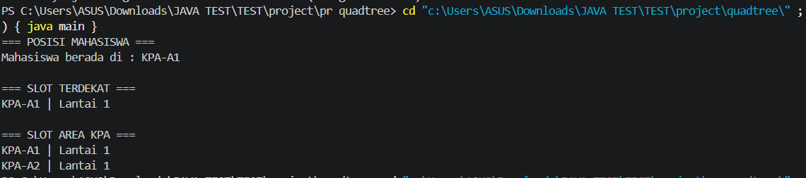
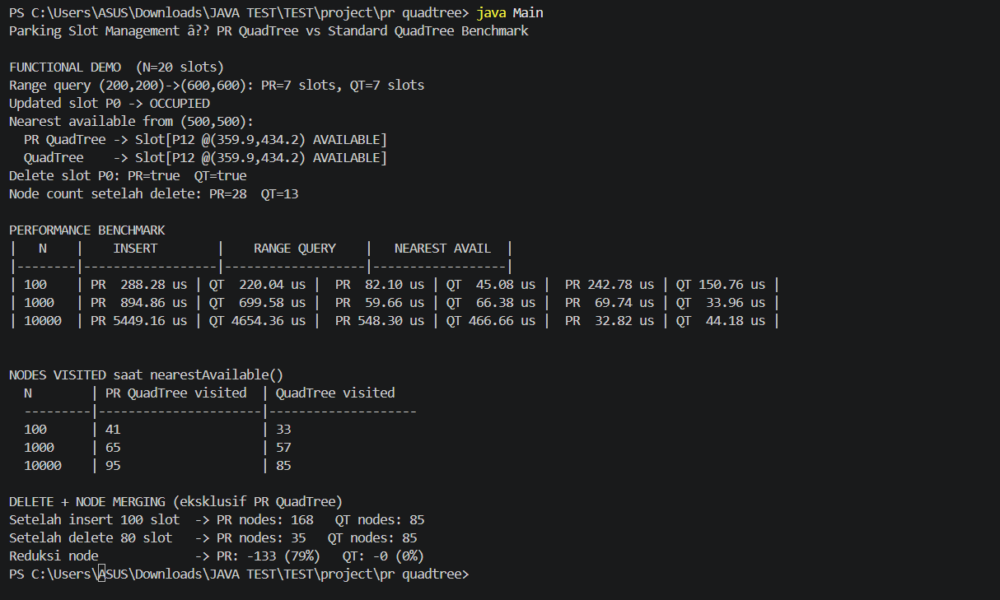

# Strukdat-K7-Eksplorasi-Tree-Tugas-3

# Implementasi Quadtree dan PR Quadtree untuk Navigasi Pencarian Slot Parkir Terdekat pada Sistem Smart Parking

---

# Kelompok 7

| No | NRP | Nama |
|---|---|---|
| 1 | 5027251106 | Senna Bagus Harimurti |
| 2 | 5027251128 | Atik Putri Matulina |
| 3 | 5027251004 | Ni Putu Maqueenta Wijaya |
| 4 | 5027251044 | Arrumanta Ekna Luhkinasih |
| 5 | 5027251068 | Keisya Halimah Mulia |

---

# Daftar Isi

1. [Problem Statement](#1-problem-statement)
2. [Penjelasan Struktur Tree dan Algoritma](#2-penjelasan-struktur-tree-dan-algoritma)
3. [Diagram dan Visualisasi](#3-diagram-dan-visualisasi)
4. [Aplikasi dan Implementasi](#4-aplikasi-dan-implementasi)
5. [Keunggulan](#5-keunggulan)
6. [Kekurangan](#6-kekurangan)
7. [Perbandingan antara Tree Dasar dan Variasi Modifikasi](#7-perbandingan-antara-tree-dasar-dan-variasi-modifikasi)
8. [Analisis Kompleksitas Berdasarkan Struktur Tree](#8-analisis-kompleksitas-berdasarkan-struktur-tree)
9. [Potensi Pengembangan ke Depan](#9-potensi-pengembangan-ke-depan)
10. [Hasil Implementasi](#10-hasil-implementasi)
11. [Perbandingan Performa Real](#11-perbandingan-performa-real)
12. [Kelebihan dan Kekurangan Program Quadtree Smart Parking](#12-kelebihan-dan-kekurangan-program-quadtree-smart-parking)
13. [Source Code](#13-source-code)
14. [Referensi Paper](#14-referensi-paper)

---

# 1. Problem Statement

Setiap hari, kawasan perkuliahan Institut Teknologi Sepuluh Nopember (ITS) khususnya di sekitar Tower 1 dipadati ribuan kendaraan mahasiswa. Dua titik parkir yang paling sering menjadi rebutan adalah parkiran FASOR dan parkiran KPA dekat TW 1. Sayangnya, kondisi di lapangan sering menyulitkan mahasiswa yang ingin parkir, terutama saat pergantian jam kuliah ataupun rush hour.

Permasalahan pertama adalah keterbatasan visibilitas area parkir. Mahasiswa yang baru masuk ke FASOR hanya dapat melihat kondisi area depan. Ketika area depan terlihat penuh, sebagian besar mahasiswa langsung menganggap seluruh area parkir sudah tidak tersedia dan memilih berpindah ke parkiran lain yang lebih jauh. Padahal, area belakang FASOR sering kali masih memiliki banyak slot kosong yang tidak terlihat dari pintu masuk.

Permasalahan kedua adalah ketidakakuratan estimasi kapasitas parkir. Motor yang diparkir tidak selalu rapi sehingga terdapat slot yang secara teoritis masih tersedia, namun secara fisik tidak dapat digunakan karena hanya menyisakan ruang sempit. Oleh karena itu, sistem tidak dapat hanya mengandalkan perhitungan kapasitas rata-rata, tetapi harus memanfaatkan representasi spasial berupa titik koordinat `(x, y)` dari slot parkir yang benar-benar valid.

Permasalahan ketiga adalah beban komputasi pencarian slot kosong. Sistem smart parking yang bekerja secara real-time harus mampu memproses ratusan hingga ribuan titik koordinat dalam waktu singkat. Jika menggunakan pendekatan linear search, sistem harus memeriksa slot satu per satu dengan kompleksitas `O(N)`. Pada kondisi padat pengguna seperti pergantian jam kuliah, pendekatan ini dapat memperlambat waktu respons sistem secara signifikan.

## Solusi yang Diusulkan

Untuk mengatasi permasalahan tersebut, digunakan struktur data spasial **Quadtree** dan variasinya yaitu **PR Quadtree (Point Region Quadtree)**. Struktur ini membagi area parkir menjadi empat wilayah (kuadran) secara hierarkis sehingga pencarian slot kosong dapat dilakukan lebih efisien.

Jika suatu area sudah penuh dan tidak memiliki slot kosong, maka seluruh region dapat langsung diabaikan melalui teknik **pruning** tanpa perlu memeriksa seluruh titik di dalamnya. Dengan pendekatan ini, pencarian slot kosong terdekat dapat dilakukan lebih cepat dibandingkan linear search dan mendekati kompleksitas `O(log N)` pada distribusi data yang baik.

## Rumusan Masalah

1. Bagaimana merepresentasikan slot parkir menggunakan struktur data spasial Quadtree?
2. Bagaimana PR Quadtree meningkatkan efisiensi pencarian dibandingkan Quadtree standar?
3. Bagaimana perbandingan performa Quadtree dan PR Quadtree dalam operasi pencarian, range query, dan delete?

---

# 2. Penjelasan Struktur Tree dan Algoritma

## 2.1 Quadtree (Tree Dasar)

Quadtree adalah struktur data hierarkis yang membagi ruang dua dimensi menjadi empat kuadran:

- North West (NW)
- North East (NE)
- South West (SW)
- South East (SE)

Setiap node dapat menyimpan beberapa titik hingga batas kapasitas tertentu (`CAPACITY`). Jika kapasitas terlampaui, node akan melakukan subdivisi menjadi empat child node.

### Karakteristik Quadtree

- Menggunakan bucket capacity
- Satu node dapat menyimpan banyak titik
- Subdivide dipicu karena kapasitas penuh
- Struktur relatif lebih dangkal
- Cocok untuk data spasial statis

---

## 2.2 PR Quadtree (Variasi Modifikasi)

PR Quadtree merupakan variasi Quadtree yang dirancang khusus untuk data titik (`point data`). Setiap leaf node hanya menyimpan satu titik.

Node pada PR Quadtree terdiri dari tiga tipe:

| Node Type | Deskripsi |
|---|---|
| EMPTY | Region kosong |
| LEAF | Menyimpan satu titik |
| INTERNAL | Sudah subdivide |

### Karakteristik PR Quadtree

- Satu leaf hanya menyimpan satu titik
- Subdivide terjadi saat collision point
- Mendukung node merging
- Lebih adaptif untuk data dinamis
- Cocok untuk sistem real-time

---

## Algoritma Insert pada Quadtree

```text
INSERT(node, point):
    if point berada di luar boundary:
        return false

    if jumlah titik < capacity:
        simpan point
        return true

    if node belum subdivide:
        subdivide()

    insert ke child yang sesuai
````

---

## Algoritma Insert pada PR Quadtree

```text
INSERT(node, point):

    if node EMPTY:
        node menjadi LEAF
        simpan point

    else if node LEAF:
        ubah menjadi INTERNAL
        subdivide()
        insert titik lama
        insert titik baru

    else:
        insert recursively ke child
```

---

## Algoritma Nearest Neighbor Search

```text
NEAREST(node, target):

    cek distance ke boundary node

    jika lebih buruk dari kandidat terbaik:
        pruning subtree

    cek point di node

    traversal child terdekat lebih dulu
```

---

# 3. Diagram dan Visualisasi

## Spatial Subdivision Quadtree


---

## Struktur Pohon Quadtree

%20untuk%20Subdivision%20di%20atas.svg)

---

## Nearest Neighbor Search + Pruning

.svg)

---

## Delete + Node Merge

.svg)

---

# 4. Aplikasi dan Implementasi

Implementasi dilakukan menggunakan bahasa Java untuk mensimulasikan sistem smart parking di kawasan ITS.

Fitur utama yang diimplementasikan:

* Insert slot parkir
* Range Query
* Nearest Neighbor Search
* Update status slot
* Delete node
* Node merging pada PR Quadtree
* Benchmark performa
* Analisis jumlah node visited

## Skenario Simulasi

Sistem mensimulasikan area:

* FASOR
* KPA
* Manarul
* Teknik Elektro

Setiap slot direpresentasikan sebagai koordinat `(x, y)` dengan status:

* AVAILABLE
* OCCUPIED

---

# 5. Keunggulan

## Keunggulan Quadtree

* Struktur lebih sederhana
* Insert lebih cepat pada data normal
* Kedalaman tree lebih rendah
* Implementasi lebih mudah

## Keunggulan PR Quadtree

* Mendukung node merging otomatis
* Lebih optimal untuk point data
* Pruning lebih efisien
* Lebih cocok untuk data dinamis
* Struktur lebih adaptif terhadap distribusi titik

---

# 6. Kekurangan

## Kekurangan Quadtree

* Tidak mendukung merge node otomatis
* Menyisakan phantom node setelah delete
* Efisiensi query dapat menurun pada data dinamis

## Kekurangan PR Quadtree

* Insert lebih lambat
* Struktur tree lebih dalam
* Overhead rekursi lebih besar
* Implementasi lebih kompleks

---

# 7. Perbandingan antara Tree Dasar dan Variasi Modifikasi

| Aspek                     | Quadtree       | PR Quadtree     |
| ------------------------- | -------------- | --------------- |
| Jenis Data                | Bucket Region  | Point Data      |
| Trigger Subdivide         | Capacity Full  | Collision Point |
| Leaf Node                 | Banyak titik   | Satu titik      |
| Delete                    | Tidak merge    | Merge otomatis  |
| Struktur                  | Lebih dangkal  | Lebih dalam     |
| Insert                    | Lebih cepat    | Lebih lambat    |
| Query Dinamis             | Kurang optimal | Lebih optimal   |
| Kompleksitas Implementasi | Rendah         | Lebih tinggi    |

---

# 8. Analisis Kompleksitas Berdasarkan Struktur Tree

## Kompleksitas Waktu

| Operasi          | Quadtree         | PR Quadtree      |
| ---------------- | ---------------- | ---------------- |
| Insert           | O(log N) average | O(log N) average |
| Search           | O(log N) average | O(log N) average |
| Delete           | O(log N)         | O(log N) + merge |
| Range Query      | O(log N + k)     | O(log N + k)     |
| Nearest Neighbor | O(log N) average | O(log N) average |

## Kompleksitas Ruang

| Struktur    | Kompleksitas |
| ----------- | ------------ |
| Quadtree    | O(N)         |
| PR Quadtree | O(N)         |

---

# 9. Potensi Pengembangan ke Depan

Pengembangan lanjutan yang dapat dilakukan:

* Integrasi GPS real-time
* Integrasi IoT Smart Parking
* Visualisasi GUI interaktif
* Dynamic Streaming Spatial Data
* Implementasi Octree untuk 3D parking
* Integrasi database dan cloud service
* Prediksi slot menggunakan machine learning

---

# 10. Hasil Implementasi

## Screenshot Output Quadtree



---

## Screenshot Output PR Quadtree



---

## Implementasi yang Berhasil Dibuat

* Standard Quadtree
* PR Quadtree
* Spatial subdivision
* Range query
* Nearest neighbor search
* Delete + node merging
* Benchmark performance
* Nodes visited analysis

---

# 11. Perbandingan Performa Real

## Metodologi Benchmark

Benchmark dilakukan menggunakan:

* Bahasa Java
* JVM Warmup
* Rata-rata 5 iterasi
* Randomized coordinate dataset
* Data size:

  * 100
  * 1000
  * 10000

Satuan waktu menggunakan mikrodetik (`µs`).

---

## Benchmark Performa

| N     | Insert PR  | Insert QT  | Range Query PR | Range Query QT | Nearest PR | Nearest QT |
| ----- | ---------- | ---------- | -------------- | -------------- | ---------- | ---------- |
| 100   | 163.10 µs  | 124.46 µs  | 18.12 µs       | 28.60 µs       | 59.16 µs   | 41.38 µs   |
| 1000  | 912.18 µs  | 553.58 µs  | 195.30 µs      | 67.58 µs       | 93.16 µs   | 102.92 µs  |
| 10000 | 8977.64 µs | 5213.64 µs | 567.04 µs      | 343.22 µs      | 35.44 µs   | 26.54 µs   |

---

## Nodes Visited

| N     | PR Nodes Visited | QT Nodes Visited |
| ----- | ---------------- | ---------------- |
| 100   | 41               | 33               |
| 1000  | 65               | 57               |
| 10000 | 95               | 85               |

---

## Analisis Benchmark

Berdasarkan benchmark:

* Standard Quadtree memiliki insert lebih cepat karena menggunakan bucket capacity.
* PR Quadtree memiliki overhead lebih besar akibat subdivisi per titik.
* PR Quadtree unggul pada delete operation karena mendukung node merging.
* Standard Quadtree tetap menyimpan phantom node setelah delete.
* PR Quadtree lebih cocok untuk sistem parkir real-time dengan data dinamis.

---

# 12. Kelebihan dan Kekurangan Program Quadtree Smart Parking
## Kelebihan

**1. Subdivisi Otomatis dan Adaptif**
Node hanya dibagi ketika kapasitas terlampaui — tidak membuang memori untuk area kosong. Struktur tree menyesuaikan diri secara dinamis sesuai distribusi data slot parkir.

**2. Pruning pada `query()`**
Sudah ada pengecekan `boundary.intersects(range)` sebelum masuk ke subtree, sehingga node yang tidak relevan langsung dilewati tanpa diperiksa isinya. Ini adalah keunggulan utama dibanding pendekatan brute force O(n).

**3. Implementasi Bersih dan Mudah Dibaca**
Struktur kode sederhana dengan tanggung jawab yang jelas per method. Cocok sebagai baseline implementasi quadtree dan mudah dikembangkan lebih lanjut.

**4. Kapasitas Fleksibel via Parameter `capacity`**
Kapasitas per node dapat diatur dari luar saat inisialisasi, sehingga dapat di-tune sesuai kebutuhan ukuran dataset tanpa mengubah logika internal.

---

## Kekurangan

**1. `nearest()` Tidak Ada Pruning Bounding Box**
Semua child dikunjungi tanpa pengecekan apakah jarak minimum bounding box ke target sudah lebih besar dari `bestDist` saat ini. Akibatnya kompleksitas praktis mendekati O(n) meski tree sudah dalam, karena tidak ada cabang yang dipangkas.

**2. Slot Lama Tidak Diredistribusi Saat `subdivide()`**
Ketika sebuah node melakukan subdivisi, slot yang sudah tersimpan di node tersebut tetap berada di parent — tidak dipindahkan ke child yang sesuai. Hal ini menyebabkan distribusi data tidak merata dan mengurangi efektivitas pruning pada operasi `query()`.

**3. Tidak Ada `updateStatus()` dan `isOccupied`**
Program tidak membedakan slot kosong dan slot terisi. Padahal untuk sistem Smart Parking, ini adalah fitur inti — seharusnya `nearest()` hanya mengembalikan slot dengan status `isOccupied = false`, bukan sembarang slot terdekat.

**4. Tidak Ada `nodesVisited` Counter**
Tidak tersedia metrik untuk mengukur efisiensi traversal secara kuantitatif. Tanpa counter ini, perbandingan performa antara Quadtree biasa dan PR Quadtree tidak dapat dilakukan secara objektif.

**5. Bug Potensial pada `nearest()` — `bestDist` Tidak Terpropagasi dengan Benar**
Variabel `bestDist` di-pass by value ke setiap pemanggilan rekursif. Akibatnya, pembaruan `bestDist` di dalam satu cabang rekursi tidak otomatis memperbarui nilai di cabang sejajar berikutnya. Ini dapat menyebabkan `nearest()` mengembalikan hasil yang tidak selalu merupakan titik terdekat yang sesungguhnya pada kasus tertentu.


# 13. Source Code

| File                            | Deskripsi                            |
| ------------------------------- | ------------------------------------ |
| `src/QUADTREE/QuadTree.java`    | Implementasi Standard Quadtree       |
| `src/QUADTREE/PRQuadTree.java`  | Implementasi PR Quadtree             |
| `src/QUADTREE/Main.java`        | Benchmark dan simulasi Smart Parking |
| `src/QUADTREE/ParkingSlot.java` | Representasi slot parkir             |
| `src/QUADTREE/Rectangle.java`   | Boundary dan spatial region          |

---

# Struktur Folder

```text
Strukdat-K7-Eksplorasi-Tree-Tugas-3/
│
├── img/
│   ├── quadtree.png
│   ├── prquadtree.png
│   ├── Diagram Spatial Subdivision Quadtree.svg
│   ├── Diagram Struktur Pohon (Tree) untuk Subdivision di atas.svg
│   ├── Diagram Nearest Neighbor Search + Pruning (Parkiran FASOR).svg
│   └── Diagram Delete + Node Merge (Eksklusif PR Quadtree).svg
│
├── paper/
│   ├── paper1.pdf
│   └── paper2.pdf
│
├── src/
│   └── QUADTREE/
│       ├── Main.java
│       ├── QuadTree.java
│       ├── PRQuadTree.java
│       ├── ParkingSlot.java
│       └── Rectangle.java
│
└── README.md
```

---

# 14. Referensi Paper

D'Angelo, A. (2016). A Brief Introduction to Quadtrees and Their Applications. School of Computer Science, Carleton University. Diakses dari: https://people.scs.carleton.ca/~maheshwa/courses/5703COMP/16Fall/quadtrees-paper.pdf

Paper ini membahas struktur Quadtree dasar beserta variasinya (Region, Point, PR Quadtree) dan aplikasinya pada spatial queries termasuk range query dan spherical region query.


Yang, G., Wu, X., & Zhang, J. (2023). A dynamic balanced quadtree for real-time streaming data. Knowledge-Based Systems, 263, 110291. Elsevier. https://doi.org/10.1016/j.knosys.2023.110291

Paper ini membahas masalah ketidakseimbangan PR Quadtree pada data streaming dan mengusulkan Dynamic Balanced Quadtree (DB-Quadtree) yang relevan dengan skenario parkir real-time di ITS.

---

# Kesimpulan

Quadtree dan PR Quadtree merupakan struktur data spasial yang efektif untuk sistem smart parking berbasis koordinat dua dimensi.

Standard Quadtree unggul pada implementasi sederhana dan insert yang lebih cepat, sedangkan PR Quadtree unggul pada pengelolaan data dinamis melalui node merging dan pruning yang lebih efisien.

Dalam konteks sistem parkir ITS yang memiliki perubahan status slot secara real-time, PR Quadtree lebih sesuai digunakan karena mampu menjaga struktur tree tetap efisien meskipun terjadi banyak operasi insert dan delete.

```
